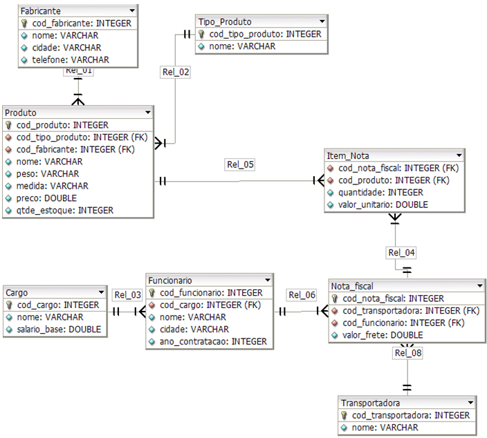

# Sistema de Gestão de Produtos e Funcionários

Este repositório contém a estrutura de um banco de dados para gerenciar um sistema de vendas, incluindo informações sobre produtos, funcionários, cargos, fabricantes, transportadoras, e notas fiscais. O banco de dados é composto por várias tabelas inter-relacionadas, com dados sobre os itens vendidos, seus fornecedores e os funcionários responsáveis pelas transações.



## Estrutura do Banco de Dados

O banco de dados é composto por 8 tabelas principais:

### 1. **Cargo**
Tabela que armazena informações sobre os cargos dos funcionários.

| Coluna           | Tipo de Dados      | Descrição                        |
|------------------|--------------------|----------------------------------|
| `cod_cargo`      | integer            | Código único do cargo            |
| `nome`           | varchar            | Nome do cargo                    |
| `salario_base`   | numeric            | Salário base do cargo            |

### 2. **Fabricante**
Tabela que armazena informações sobre os fabricantes dos produtos.

| Coluna           | Tipo de Dados      | Descrição                        |
|------------------|--------------------|----------------------------------|
| `cod_fabricante` | integer            | Código único do fabricante       |
| `nome`           | varchar            | Nome do fabricante               |
| `cidade`         | varchar            | Cidade do fabricante             |
| `telefone`       | varchar            | Telefone de contato do fabricante|

### 3. **Funcionário**
Tabela que armazena informações sobre os funcionários da empresa.

| Coluna            | Tipo de Dados      | Descrição                          |
|-------------------|--------------------|------------------------------------|
| `cod_funcionario` | integer            | Código único do funcionário        |
| `cod_cargo`       | integer            | Código do cargo do funcionário     |
| `nome`            | varchar            | Nome do funcionário                |
| `cidade`          | varchar            | Cidade do funcionário              |
| `ano_contratacao` | integer            | Ano de contratação do funcionário  |

### 4. **Item Nota**
Tabela que detalha os itens que foram vendidos em cada nota fiscal.

| Coluna             | Tipo de Dados      | Descrição                        |
|--------------------|--------------------|----------------------------------|
| `cod_nota_fiscal`  | integer            | Código único da nota fiscal      |
| `cod_produto`      | integer            | Código do produto                |
| `quantidade`       | integer            | Quantidade de produtos vendidos |
| `valor`            | numeric            | Valor total do item              |

### 5. **Nota Fiscal**
Tabela que armazena informações sobre as notas fiscais emitidas.

| Coluna             | Tipo de Dados      | Descrição                        |
|--------------------|--------------------|----------------------------------|
| `cod_nota_fiscal`  | integer            | Código único da nota fiscal      |
| `cod_transportadora` | integer           | Código da transportadora         |
| `cod_funcionario`  | integer            | Código do funcionário responsável|
| `valor_frete`      | numeric            | Valor do frete                   |

### 6. **Produto**
Tabela que armazena informações sobre os produtos vendidos.

| Coluna             | Tipo de Dados      | Descrição                        |
|--------------------|--------------------|----------------------------------|
| `cod_produto`      | integer            | Código único do produto          |
| `cod_tipo_produto` | integer            | Tipo do produto                  |
| `cod_fabricante`   | integer            | Código do fabricante             |
| `nome`             | varchar            | Nome do produto                  |
| `peso`             | varchar            | Peso do produto                  |
| `medida`           | varchar            | Medida usada para o produto      |
| `preco`            | numeric            | Preço do produto                 |
| `qtde_estoque`     | integer            | Quantidade em estoque            |

### 7. **Tipo Produto**
Tabela que classifica os produtos em tipos, como alimentos, eletrônicos, etc.

| Coluna             | Tipo de Dados      | Descrição                        |
|--------------------|--------------------|----------------------------------|
| `cod_tipo_produto` | integer            | Código do tipo de produto        |
| `nome`             | varchar            | Nome do tipo de produto          |

### 8. **Transportadora**
Tabela que armazena informações sobre as transportadoras.

| Coluna            | Tipo de Dados      | Descrição                        |
|-------------------|--------------------|----------------------------------|
| `cod_transportadora` | integer          | Código da transportadora         |
| `nome`            | varchar            | Nome da transportadora           |

## Relacionamentos Entre Tabelas

As tabelas estão interligadas através de chaves primárias e estrangeiras. Alguns exemplos de relações importantes:

- **Funcionario -> Cargo**: Cada funcionário tem um cargo, definido pela chave estrangeira `cod_cargo` na tabela `funcionario`.
- **Produto -> Tipo Produto**: Cada produto é classificado por um tipo, indicado pela chave estrangeira `cod_tipo_produto` na tabela `produto`.
- **Produto -> Fabricante**: Cada produto tem um fabricante, indicado pela chave estrangeira `cod_fabricante` na tabela `produto`.
- **Nota Fiscal -> Funcionário**: Cada nota fiscal é associada a um funcionário que a emitiu, através da chave estrangeira `cod_funcionario` na tabela `nota_fiscal`.
- **Nota Fiscal -> Transportadora**: Cada nota fiscal tem uma transportadora associada, através da chave estrangeira `cod_transportadora` na tabela `nota_fiscal`.

## Exemplos de Consultas

Aqui estão alguns exemplos de como consultar dados dentro desse banco de dados:

1. **Obter todos os produtos de um fabricante específico:**

```sql
SELECT nome, preco
FROM produto
WHERE cod_fabricante = 1;  -- Substitua pelo código do fabricante desejado
```

2. **Verificar os funcionários contratados em um ano específico:**

```sql
SELECT nome, cargo, ano_contratacao
FROM funcionario
WHERE ano_contratacao = 2005;  -- Substitua pelo ano desejado
```

3. **Consultar o total de vendas por nota fiscal:**

```sql
SELECT nf.cod_nota_fiscal, SUM(inf.quantidade * inf.valor) AS total_venda
FROM nota_fiscal nf
JOIN item_nota inf ON nf.cod_nota_fiscal = inf.cod_nota_fiscal
GROUP BY nf.cod_nota_fiscal;
```

## Considerações

Este banco de dados foi projetado para gerenciar uma pequena empresa de vendas, que inclui produtos, notas fiscais, fabricantes, e funcionários. Ele pode ser expandido ou modificado para atender a outros requisitos específicos de negócios.
